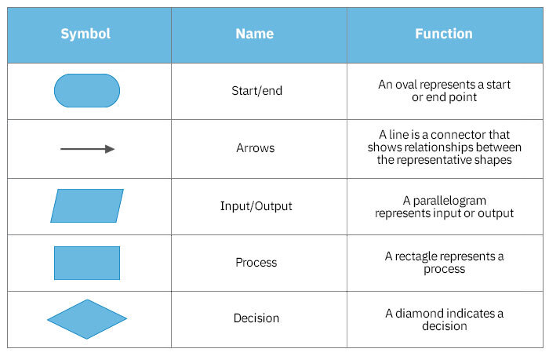

# Flowchart

A flowchart is a type of diagram that represents a workflow or process. A flowchart can also be defined as a diagrammatic representation of an algorithm, a step-by-step approach to solving a task.

# Flowchart symbols

These flowchart shapes and symbols are some of the most common types you'll find in most flowchart diagrams.

## Questions for Practice

[Print Sum of two numbers]()

[Print Average of three Number](https://www.youtube.com/watch?v=WQoB2z67hvY&list=PLDzeHZWIZsToJ9zSl4-5BfOBzAR0fm--f&index=2)

[Print twice of a number](https://www.youtube.com/watch?v=WQoB2z67hvY&list=PLDzeHZWIZsToJ9zSl4-5BfOBzAR0fm--f&index=2)

[Print the Even and odd number](https://www.youtube.com/watch?v=WQoB2z67hvY&list=PLDzeHZWIZsToJ9zSl4-5BfOBzAR0fm--f&index=2)

[Print Counting from 1 to N](https://www.youtube.com/watch?v=WQoB2z67hvY&list=PLDzeHZWIZsToJ9zSl4-5BfOBzAR0fm--f&index=2)

[Print Factorial of a number](https://www.youtube.com/watch?v=WQoB2z67hvY&list=PLDzeHZWIZsToJ9zSl4-5BfOBzAR0fm--f&index=2)

[Print 1 to N but only even number](https://www.youtube.com/watch?v=WQoB2z67hvY&list=PLDzeHZWIZsToJ9zSl4-5BfOBzAR0fm--f&index=2)

[Check if a number is prime or not](https://www.youtube.com/watch?v=WQoB2z67hvY&list=PLDzeHZWIZsToJ9zSl4-5BfOBzAR0fm--f&index=2)

[Check valid triangle or not](https://www.youtube.com/watch?v=WQoB2z67hvY&list=PLDzeHZWIZsToJ9zSl4-5BfOBzAR0fm--f&index=2)

[Print max of three number](https://www.youtube.com/watch?v=WQoB2z67hvY&list=PLDzeHZWIZsToJ9zSl4-5BfOBzAR0fm--f&index=2)
